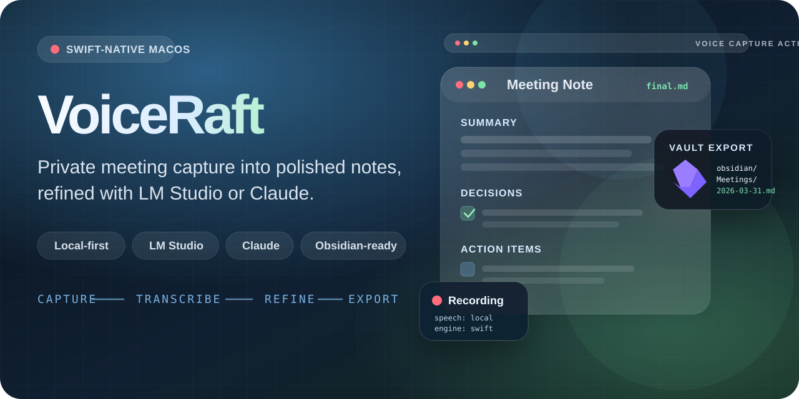

<p align="center">
  
</p>

VoiceRaft is a macOS menu-bar app that captures meeting audio, transcribes it with Apple's Speech framework, turns the transcript into structured notes with LM Studio or Claude, and exports the result into an Obsidian vault.

- Local-first by default, with on-device transcription and a local LM Studio endpoint out of the box
- Runtime-selectable notes providers: `LM Studio` and `Claude`
- Structured meeting output with summaries, decisions, action items, and follow-up notes
- Native Swift menu-bar workflow built for direct macOS use

## Installation

Download the latest `.dmg` from [GitHub Releases](../../releases), open it, and drag `VoiceRaft.app` into `Applications`.

Current release artifacts are published as `VoiceRaft-vX.Y.Z.dmg`.

## Requirements

- macOS with microphone access and speech recognition permission enabled for the app
- Either LM Studio running locally, or an Anthropic API key saved in Settings for Claude
- An Obsidian vault path configured in the app
- For online meetings, the correct helper input device selected in settings if you use loopback or multi-output routing

## Quick Start

1. Install VoiceRaft from the latest GitHub Release, or build it locally from Xcode.
2. Launch the app and grant microphone and speech recognition access.
3. Open Settings and set your Obsidian vault path.
4. Choose a notes provider:
   - `LM Studio`: confirm the base URL and model.
   - `Claude`: save an Anthropic API key, refresh models, and choose a `claude-*` model.
5. Start a `Room` or `Online` session from the menu bar and stop recording when the meeting ends.
6. VoiceRaft transcribes the audio, runs the note-generation workflow, and writes the final markdown into your vault.

## Provider Setup

### LM Studio

- Select `LM Studio` in Settings.
- Keep the default local base URL or point it at your OpenAI-compatible LM Studio endpoint.
- Choose the model you want VoiceRaft to use for drafting, judging, and revision.

### Claude

- Select `Claude` in Settings.
- Save an Anthropic API key. The key is stored in macOS Keychain, not in `UserDefaults`.
- Use `Refresh Models` to fetch available `claude-*` models for that key.
- Pick a current Claude model before processing a meeting.

## Development

Build the app:

```bash
xcodebuild -project voiceraft.xcodeproj -scheme voiceraft build
```

Run package tests:

```bash
swift test --package-path Packages/VoiceRaftCore
```

Open the project in Xcode:

```bash
open voiceraft.xcodeproj
```

## Releases

VoiceRaft uses semver Git tags and GitHub Releases for distributable builds.

To publish a release:

1. Push a semver tag like `v1.2.3`.
2. GitHub Actions builds the app with `xcodebuild`.
3. The workflow packages `VoiceRaft-v1.2.3.dmg`.
4. The DMG is uploaded to the matching GitHub Release.

By default, the release workflow produces an unsigned `.dmg` so the pipeline works immediately in open source. 

If macOS warns that VoiceRaft is damaged or refuses to open it, remove the quarantine flag and try again:

```bash
xattr -dr com.apple.quarantine /Applications/VoiceRaft.app
open /Applications/VoiceRaft.app
```

## Contributing

Issues and pull requests are welcome.

- Open an issue for bugs, UX problems, or release/distribution issues.
- Keep changes focused and include verification steps in your PR description.
- If you change packaging or release behavior, update the README and relevant scripts/workflows together.

## License

VoiceRaft is released under the [MIT License](LICENSE).

## Architecture

Technical architecture notes, workflow details, and the codebase map live in [docs/architecture.md](docs/architecture.md).

## Roadmap

- LangGraph-Swift migration for a more formal state-graph orchestration layer
- More VoiceRaftCore extraction so a larger share of the workflow is covered by `swift test`
- Apple Foundation Models as an additional provider option
- Live transcription during recording
- Pending export retry UI in the menu bar
