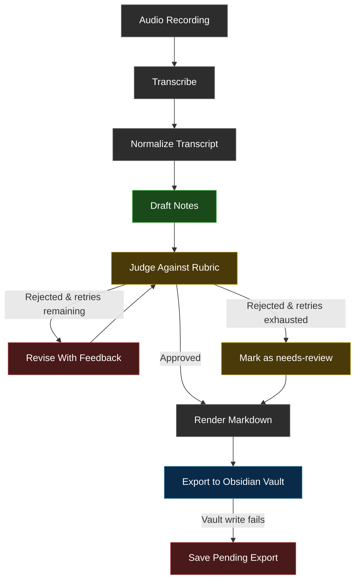

<p align="center">
  
</p>

VoiceRaft is a macOS menu-bar app that captures meeting audio, transcribes it locally with Apple's Speech framework, refines structured notes through a multi-pass draft-judge-revise workflow, and exports the finished markdown into an Obsidian vault. The entire pipeline runs inside the native Swift app.

- Local-first by default, with on-device transcription and a local LM Studio endpoint configured out of the box
- Runtime-selectable notes provider with `LM Studio` and `Claude` available from Settings
- Agentic draft, judge, and revise workflow for meeting notes that read like notes instead of raw transcripts
- Native Swift app flow built around clean Obsidian markdown export

## Why VoiceRaft

- **Flexible note generation.** Keep the default local LM Studio path or switch to Claude when you want a direct Anthropic provider.
- **Local-first workflow.** Meeting audio stays on your Mac, transcription uses Apple's Speech framework, and the default LM Studio base URL points at `http://127.0.0.1:1234/v1`.
- **Agentic note quality.** VoiceRaft uses a judge-driven revision loop that drafts notes, evaluates them against a quality rubric, and revises until the judge approves or retries are exhausted.
- **Obsidian-native output.** Notes keep stable frontmatter and structured sections for Summary, Decisions, Action Items, Open Questions / Risks, and Follow-Up.

## Tech Stack

| Layer | Technology |
| --- | --- |
| Language | Swift 6.1 |
| App framework | AppKit (menu bar) + SwiftUI (settings window) |
| Audio capture | AVCaptureSession / AVCaptureAudioFileOutput |
| Transcription | Apple Speech framework (on-device with server-side fallback) |
| LLM providers | LM Studio (OpenAI-compatible endpoint), Claude (Anthropic Messages API) |
| Structured output | JSON Schema for both providers |
| Secret storage | macOS Keychain Services (Claude API key) |
| Settings | UserDefaults |
| Package testing | Swift Package Manager / swift test |
| Output format | Obsidian-compatible markdown with YAML frontmatter |
| Build system | Xcode / xcodebuild |

## How It Works

1. Start a `Room` or `Online` session from the menu bar and give the meeting a title.
2. VoiceRaft records audio to an M4A file via AVCaptureSession.
3. After you stop, the app transcribes the recording using Apple's Speech framework (on-device first, server-side fallback if empty).
4. The transcript enters the draft-judge-revise workflow with the selected LLM provider.
5. Final markdown is written into the Obsidian vault. If the vault write fails, VoiceRaft saves a pending export locally so the note is not lost.

## Workflow Architecture

VoiceRaft uses a protocol-driven agentic workflow inspired by LangGraph's graph-based orchestration pattern. The current implementation is a native Swift async/await pipeline with the same node and routing semantics, built on `MeetingNotesModeling` and `TranscriptService` protocols. A future refactor to [LangGraph-Swift](https://github.com/nicktmro/langchain-swift) is planned to formalize the graph structure.

### Workflow Graph



### Graph Nodes

| Node | Protocol | Responsibility |
| --- | --- | --- |
| Transcribe | `TranscriptService` | Apple Speech framework, on-device with server-side fallback |
| Normalize | Internal | Collapse whitespace and trim the raw transcript |
| Draft | `MeetingNotesModeling.draft` | Generate structured meeting notes from transcript + metadata |
| Judge | `MeetingNotesModeling.judge` | Evaluate draft against a quality rubric (no unsupported claims, clear decisions vs open questions, professional tone) |
| Revise | `MeetingNotesModeling.revise` | Improve draft using judge feedback while preserving factual grounding |
| Render | `MarkdownRendering` | Convert structured result to Obsidian-compatible markdown |

### Routing Rules

- **Judge approves** -> finish with status `final`
- **Judge rejects, retries < 2** -> route to Revise, then back to Judge
- **Judge rejects, retries exhausted** -> finish with status `needs-review` and include judge feedback as a review banner

### Planned: LangGraph-Swift Integration

The workflow is designed around the same concepts as [LangGraph](https://github.com/langchain-ai/langgraph) — typed state, named nodes, and conditional routing. A planned refactor will move the orchestration layer to [LangGraph-Swift](https://github.com/nicktmro/langchain-swift) to formalize:

- Explicit `StateGraph` definition with typed `MeetingWorkflowState`
- Declarative node registration and conditional edge routing
- Built-in retry and checkpoint semantics from the LangGraph runtime

The protocol-based architecture (`MeetingNotesModeling`, `TranscriptService`, `MarkdownRendering`) is already aligned with this migration — the node implementations stay the same, only the orchestration layer changes.

## What You Need

- macOS with microphone access and speech recognition permission enabled for the app
- LM Studio running locally, or an Anthropic API key saved in Settings for Claude
- An Obsidian vault path provided in config via `AppSettings.obsidianVaultPath`
- For online meetings, the correct helper input device selected in settings if you use loopback or multi-output audio routing

## Quick Start

```bash
xcodebuild -project voiceraft.xcodeproj -scheme voiceraft -configuration Debug CODE_SIGNING_ALLOWED=NO build
open voiceraft.xcodeproj
```

1. Start LM Studio and load the model you want VoiceRaft to use if you plan to stay on the default local provider.
2. Run the `voiceraft` scheme from Xcode.
3. On first launch, grant microphone and speech recognition access.
4. Open VoiceRaft Settings and set your Obsidian vault path plus optional online meeting input device.
5. Choose `Notes Provider`:
   - For `LM Studio`, confirm the base URL and model.
   - For `Claude`, paste your Anthropic API key, save it, then pick one of the fetched Claude models.
6. Use the menu bar icon to start and stop meeting capture.

## Provider Setup

### LM Studio

- Select `LM Studio` in Settings.
- Set the base URL and model if you are not using the defaults (`http://127.0.0.1:1234/v1`).
- VoiceRaft connects through the OpenAI-compatible chat completions endpoint at runtime.
- Both providers use JSON Schema structured output to ensure valid, parseable responses.

### Claude

- Select `Claude` in Settings.
- Save an Anthropic API key from the Claude settings section. The key is stored in macOS Keychain, not in UserDefaults.
- Use `Refresh Models` to load the available `claude-*` models for that key.
- Choose a currently available Claude model before starting a meeting.
- VoiceRaft re-checks the selected model before processing. If the saved model is no longer available, the app asks you to choose a current one.

## Architecture

```text
voiceraft/                          # macOS app target
├── main.swift                      # NSApplication entry point (.accessory activation)
├── VoiceRaftAppDelegate.swift      # Menu bar shell, Edit menu, state wiring
├── SessionCoordinator.swift        # Capture → process → export orchestration
├── NativeMeetingProcessor.swift    # Transcription + provider-aware workflow runner
├── AudioCaptureService.swift       # AVCaptureSession recording to M4A
├── AppSettings.swift               # Provider-aware settings with backward-compat decode
├── SettingsUI.swift                # SwiftUI settings with provider picker
├── ClaudeSettingsModel.swift       # Claude key/model loading state
├── KeychainSecretStore.swift       # Keychain wrapper for API key storage
├── StatusItemAppearance.swift      # Menu bar icon color by state
└── SupportServices.swift           # Obsidian vault writer, pending export, file layout

Packages/VoiceRaftCore/             # In-repo Swift package (swift test)
├── Sources/VoiceRaftCore/
│   ├── WorkflowModels.swift        # Domain types, protocols, errors
│   ├── MeetingWorkflowEngine.swift # Draft → judge → revise loop
│   ├── LMStudioClient.swift        # OpenAI-compatible HTTP client
│   ├── ClaudeClient.swift          # Anthropic Messages API client
│   ├── AnthropicModelsService.swift# Paginated Claude model discovery
│   └── MarkdownRenderer.swift      # Obsidian markdown output
└── Tests/VoiceRaftCoreTests/       # Package-level tests
```

## Development

Build the app:

```bash
xcodebuild -project voiceraft.xcodeproj -scheme voiceraft build
```

Run package tests:

```bash
swift test --package-path Packages/VoiceRaftCore
```

Key entry points:

- `voiceraft/SessionCoordinator.swift` — capture -> process -> export flow
- `voiceraft/NativeMeetingProcessor.swift` — transcription and provider-aware workflow
- `Packages/VoiceRaftCore/Sources/VoiceRaftCore/MeetingWorkflowEngine.swift` — draft-judge-revise loop
- `voiceraft/SettingsUI.swift` and `voiceraft/AppSettings.swift` — runtime configuration

Runtime config lives in `UserDefaults` under `VoiceRaft.AppSettings` for non-secret settings. Claude API keys live in macOS Keychain. The Obsidian location comes from `obsidianVaultPath`.

## Releases

VoiceRaft uses semver Git tags and GitHub Releases for distributable builds.

To publish a release:

1. Push a semver tag like `v1.2.3`.
2. GitHub Actions builds the app with `xcodebuild`.
3. The workflow packages `VoiceRaft-v1.2.3.dmg`.
4. The DMG is uploaded to the matching GitHub Release.

By default, the release workflow produces an unsigned `.dmg` so the pipeline works immediately in open source. If you later add Apple credentials, the same workflow can also sign with `Developer ID Application` and notarize the release artifact.

Optional signing/notarization secrets:

- `MACOS_CERT_P12_BASE64`
- `MACOS_CERT_PASSWORD`
- `MACOS_SIGNING_IDENTITY`
- `APPLE_TEAM_ID`
- `APPLE_API_KEY_ID`
- `APPLE_API_ISSUER_ID`
- `APPLE_API_PRIVATE_KEY`

The release workflow lives at [.github/workflows/release.yml](/.github/workflows/release.yml) and uses [scripts/build-release-dmg.sh](/scripts/build-release-dmg.sh) plus [scripts/sign-and-notarize.sh](/scripts/sign-and-notarize.sh).

## Outstanding Work

- **LangGraph-Swift migration** — refactor the workflow engine from imperative async/await loops to a declarative `StateGraph` using [LangGraph-Swift](https://github.com/nicktmro/langchain-swift), adding formal node/edge definitions and checkpoint support
- **VoiceRaftCore extraction** — continue moving workflow logic from the app target into `Packages/VoiceRaftCore` so more of the pipeline is covered by `swift test`
- **Apple Foundation Models** — evaluate on-device Apple Foundation Models as an additional provider alongside LM Studio and Claude
- **Live transcription** — stream partial transcripts during recording instead of batch-processing after stop
- **Pending export retry UI** — surface pending exports in the menu bar so failed vault writes can be retried without reprocessing
