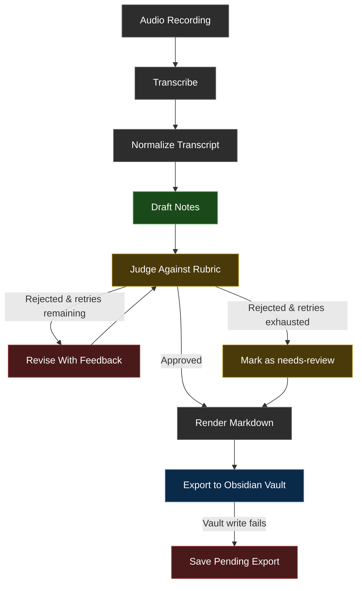

# Architecture

VoiceRaft is a native Swift macOS menu-bar app with a protocol-driven workflow for transcription, note generation, and Obsidian export. The app target owns the macOS UI, capture flow, settings, and file-system integration, while `Packages/VoiceRaftCore` contains the workflow engine plus provider implementations.

## Tech Stack

| Layer | Technology |
| --- | --- |
| Language | Swift 6.1 |
| App framework | AppKit (menu bar) + SwiftUI (settings window) |
| Audio capture | AVCaptureSession / AVCaptureAudioFileOutput |
| Transcription | Apple Speech framework (on-device with server-side fallback) |
| LLM providers | LM Studio (OpenAI-compatible endpoint), Claude (Anthropic Messages API) |
| Structured output | JSON Schema for both providers |
| Secret storage | macOS Keychain Services (Claude API key) |
| Settings | UserDefaults |
| Package testing | Swift Package Manager / swift test |
| Output format | Obsidian-compatible markdown with YAML frontmatter |
| Build system | Xcode / xcodebuild |

## End-To-End Flow

1. Start a `Room` or `Online` session from the menu bar and give the meeting a title.
2. VoiceRaft records audio to an M4A file via `AVCaptureSession`.
3. After you stop, the app transcribes the recording using Apple's Speech framework.
4. The transcript enters the draft-judge-revise workflow with the selected LLM provider.
5. Final markdown is written into the Obsidian vault. If the vault write fails, VoiceRaft saves a pending export locally so the note is not lost.

## Workflow Architecture

VoiceRaft uses a protocol-driven agentic workflow inspired by LangGraph's graph-based orchestration pattern. The current implementation is a native Swift async/await pipeline with the same node and routing semantics, built on `MeetingNotesModeling` and `TranscriptService` protocols.

### Workflow Graph



### Graph Nodes

| Node | Protocol | Responsibility |
| --- | --- | --- |
| Transcribe | `TranscriptService` | Apple Speech framework, on-device with server-side fallback |
| Normalize | Internal | Collapse whitespace and trim the raw transcript |
| Draft | `MeetingNotesModeling.draft` | Generate structured meeting notes from transcript + metadata |
| Judge | `MeetingNotesModeling.judge` | Evaluate draft against a quality rubric |
| Revise | `MeetingNotesModeling.revise` | Improve draft using judge feedback while preserving factual grounding |
| Render | `MarkdownRendering` | Convert structured result to Obsidian-compatible markdown |

### Routing Rules

- Judge approves: finish with status `final`
- Judge rejects with retries remaining: route to Revise, then back to Judge
- Judge rejects with retries exhausted: finish with status `needs-review` and include judge feedback as a review banner

## Planned LangGraph-Swift Integration

The workflow is designed around the same concepts as LangGraph: typed state, named nodes, and conditional routing. A future refactor will move the orchestration layer to LangGraph-Swift to formalize:

- explicit `StateGraph` definition with typed `MeetingWorkflowState`
- declarative node registration and conditional edge routing
- built-in retry and checkpoint semantics from the runtime

The protocol-based architecture already aligns with this migration, so the node implementations can stay mostly the same while the orchestration layer changes.

## Codebase Map

```text
voiceraft/                          # macOS app target
├── main.swift                      # NSApplication entry point (.accessory activation)
├── VoiceRaftAppDelegate.swift      # Menu bar shell, Edit menu, state wiring
├── SessionCoordinator.swift        # Capture → process → export orchestration
├── NativeMeetingProcessor.swift    # Transcription + provider-aware workflow runner
├── AudioCaptureService.swift       # AVCaptureSession recording to M4A
├── AppSettings.swift               # Provider-aware settings with backward-compat decode
├── SettingsUI.swift                # SwiftUI settings with provider picker
├── ClaudeSettingsModel.swift       # Claude key/model loading state
├── KeychainSecretStore.swift       # Keychain wrapper for API key storage
├── StatusItemAppearance.swift      # Menu bar icon color by state
└── SupportServices.swift           # Obsidian vault writer, pending export, file layout

Packages/VoiceRaftCore/             # In-repo Swift package
├── Sources/VoiceRaftCore/
│   ├── WorkflowModels.swift        # Domain types, protocols, errors
│   ├── MeetingWorkflowEngine.swift # Draft → judge → revise loop
│   ├── LMStudioClient.swift        # OpenAI-compatible HTTP client
│   ├── ClaudeClient.swift          # Anthropic Messages API client
│   ├── AnthropicModelsService.swift# Paginated Claude model discovery
│   └── MarkdownRenderer.swift      # Obsidian markdown output
└── Tests/VoiceRaftCoreTests/       # Package-level tests
```

## Key Entry Points

- `voiceraft/SessionCoordinator.swift` for the capture-to-export flow
- `voiceraft/NativeMeetingProcessor.swift` for transcription and provider-aware workflow execution
- `Packages/VoiceRaftCore/Sources/VoiceRaftCore/MeetingWorkflowEngine.swift` for the draft-judge-revise loop
- `voiceraft/SettingsUI.swift` and `voiceraft/AppSettings.swift` for runtime configuration
